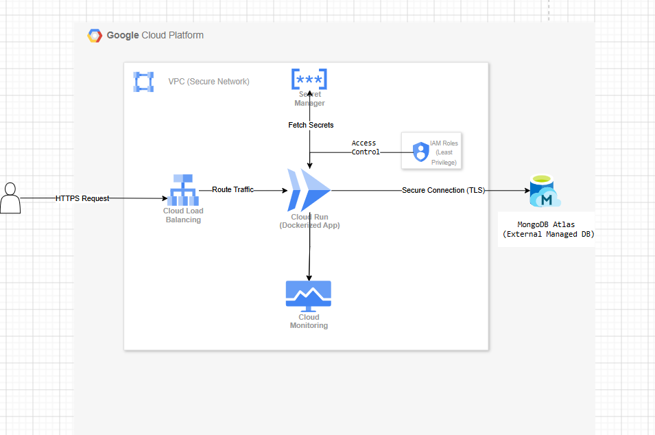

# Part 2: Infrastructure Design on GCP

## Architecture Diagram

---

## Overview

This setup is designed for a startup-friendly environment where we need:
- Auto-scaling  
- Secure access  
- Low cost  
- Minimal operational overhead  

The application is deployed using a serverless approach to avoid managing infrastructure manually.

---

## Compute Choice

I have chosen Cloud Run to run the application.

Cloud Run allows us to deploy a Docker container directly without managing any servers. It automatically scales based on incoming traffic and can even scale down to zero when there are no requests, which helps reduce cost.

I did not choose Compute Engine because it requires manual server management, scaling setup, and continuous running cost even when the application is idle. I also avoided GKE as it is more complex and better suited for large-scale systems.

---

## Database Choice

The application uses MongoDB Atlas as the database.

MongoDB Atlas is a fully managed database service, so it handles backups, scaling, and availability automatically. This removes the need to install and manage MongoDB manually on virtual machines.

---

## Networking

The application is exposed over HTTPS and follows this flow:
User → HTTPS Endpoint → Cloud Run → MongoDB Atlas

A VPC (Virtual Private Cloud) is used to provide secure communication between services. If needed, a Serverless VPC Connector can be used to allow Cloud Run to securely connect to the database.

This ensures that internal communication is not exposed publicly.

---

## Secrets & IAM

Sensitive information such as database credentials is stored in Secret Manager.

Access control is handled using IAM, where:
- The application is given only the required permissions  
- Secrets are accessed securely at runtime  

This follows the principle of least privilege and improves security.

---

## Logging & Monitoring

For observability, the following services are used:

- Cloud Logging → captures application logs  
- Cloud Monitoring → tracks metrics and alerts  

This helps in debugging issues, tracking performance, and setting up alerts for failures.

---

## Cost Optimization

This architecture is cost-efficient because:
- Cloud Run scales to zero (no cost when idle)  
- No need to maintain virtual machines  
- MongoDB Atlas can start with a free or small cluster  

This makes it suitable for startups or small teams.

---

## Summary

| Component | Choice |
|----------|-------|
| Compute | Cloud Run |
| Database | MongoDB Atlas |
| Networking | HTTPS + VPC |
| Secrets | Secret Manager |
| Access Control | IAM |
| Monitoring | Cloud Logging & Monitoring |

---

## Final Thought

This design focuses on simplicity, security, and scalability. By using serverless and managed services
